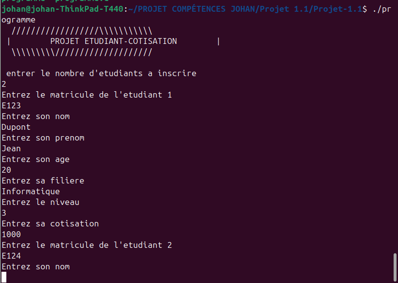

# Gestion des étudiants et cotisations
Ce projet est une application en langage C qui permet de gérer les informations des étudiants et leurs cotisations au sein d'un club.


## Fonctionnalités

- Ajouter des étudiants avec leurs informations personnelles et leurs cotisations.
- Modifier les informations d'un étudiant existant.
- Supprimer les informations d'un étudiant par son matricule ou son numéro.
- Afficher la liste complète des étudiants et leurs cotisations.
- Calculer le montant total des cotisations.
- Rechercher les informations d'un étudiant spécifique par son matricule.

---
## Installation et Compilation

1. Cloner le dépôt
Clonez le projet depuis GitHub :
```sh
git clone https://github.com/johanalain11/etudiant-cotisation.git
cd etudiant-cotisation
```
2. Compiler le code
```sh
gcc programme.c -o gestion_etudiants
```
3. Exécuter l'application
```sh
./gestion_etudiants
```

---
## Utilisation
1. Lancez le programme.
2. Entrez le nombre d'étudiants à inscrire.
3. Suivez les instructions pour saisir les informations des étudiants.
4. Choisissez une opération dans le menu :
    * Modifier les données d'un étudiant.
    * Supprimer les données d'un étudiant par son numéro.
    * Supprimer les données d'un étudiant par son matricule.
    * Afficher la liste des étudiants et leurs cotisations.
    * Calculer le montant total cotisé.
    * Rechercher un étudiant par son matricule.
    * Quitter le programme.

---
## Exemple d'exécution


---
## Structure de données
Chaque étudiant est représenté par une structure etudiant :
```c
struct etudiant
{
    char matricule[50];
    char nom[50];
    char prenom[50];
    int age;
    char filiere[50];
    int niveau;
    int cotisation;
};
```

---
## Technologies Utilisées
**Langage de programmation :** C

**Compilateur :** GCC

---
## Améliorations Futures
>[!NOTE]
>
>* Ajouter une interface graphique.
>* Ajouter une validation plus robuste des entrées utilisateur.
>* Gérer les erreurs potentielles, comme des entrées invalides ou des dépassements de mémoire.
>* Ajouter un système de sauvegarde et de chargement des données dans un fichier.

## Auteur
**Johan Alain**

[GitHub](https://github.com/johanalain11/)
